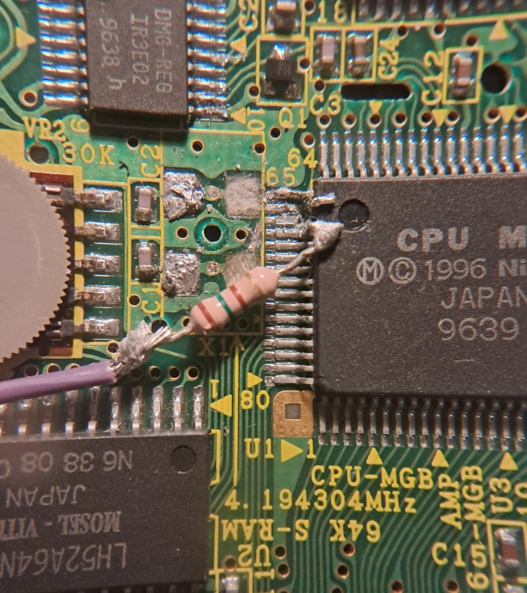
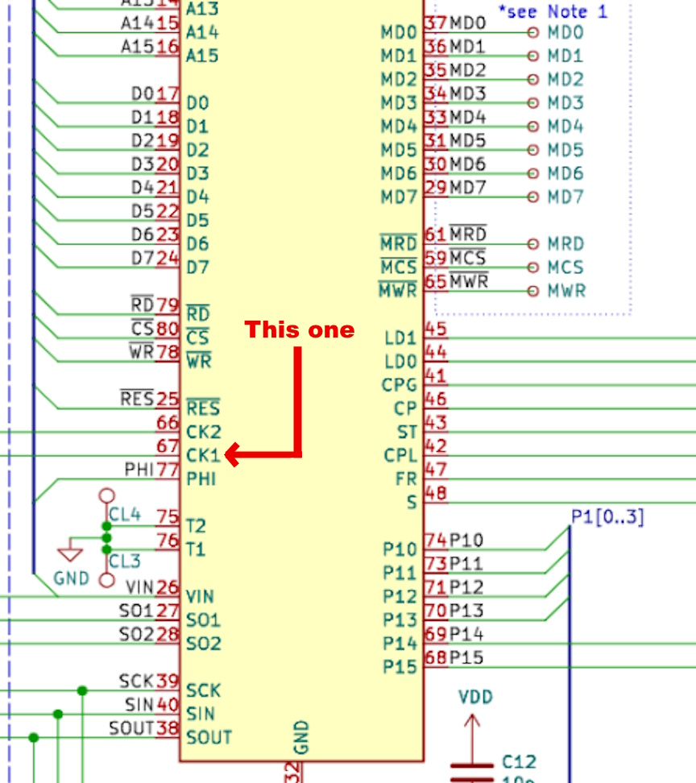
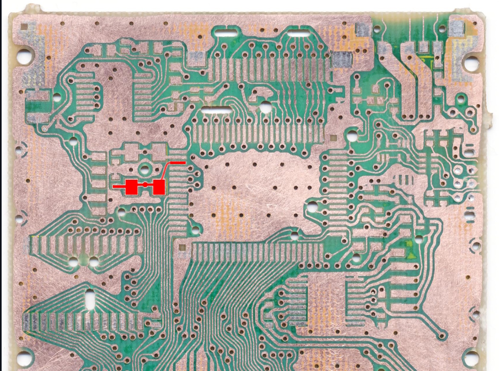
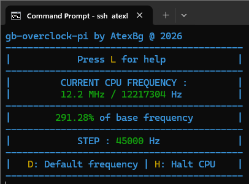

# gb-overclock-rpi - By AtexBg

### This tool allows you to easily overclock or underclock a Game Boy CPU using a Raspberry Pi, without any additional ICs or complex electronics.

### DISCLAIMER ⚠ This project involves hardware modification and soldering. Proceed at your own risk.

## Compatible Hardware:
I tested with a RaspberryPi 3B+ and a GameBoy Pocket (I wasn't brave enough to test it on my GBA 😅), but it should work on any RPi/GB model (and even other devices using a quartz oscillator), see [Hardware Install](#hardware-install).

## How does it work?
For context, every Gameboy (excluding the GB Micro) uses a [Crystal Oscillator](https://en.wikipedia.org/wiki/Crystal_oscillator) with a frequency of 2^22 Hz (4194304Hz, or around 4.2MHz), but if you replace the crystal with another one, or even inject your own signal into it, you can effectively control the speed of **ALL THE HARDWARE** of the console, including data R/W (which may lead to crashes above 12-15 MHz), Link port SPI, PPU timings, etc...

And this code uses the GPCLK pin of a RaspberryPi (GPIO 4, Physical Pin 7) to generate a frequency which can be injected into a Gameboy's CPU.

## Hardware install
Here's everything you will need :

    - A RaspberryPi (models 1 to 4 should work, but not the Pi5 nor the Pico)
    - A GameBoy (obviously) : Tested on Pocket but most DMG-compatible model should work
    - A wire that can be connected to the GPIO pins
    - A small value resistor for security (between 100Ω and 500Ω should be fine)
    

To make this mod work, you must remove or disconnect the original crystal oscillator before injecting the external clock signal and inject any arbitrary frequency into the circuit, solder it with the resistor in series as shown in the first picture on the left pin of the quartz (with the CPU facing towards you), or the 67th pin of the processor :

Go see [the GameBoy related schematics](https://github.com/Gekkio/gb-schematics) from Gekkio for more info if needed.

Also don't forget to add a common GND between the GB and the RPi !

## Usage
On the hardware side :
    - Plug the pin soldered to the oscillator on [the GPCLK pin](https://pinout.xyz/pinout/pin7_gpio4/) and the common GND.
On the software side :
    - Compile the program by running `make` into the source directory
    - Execute the program with root access (by opening a root shell using `sudo bash` or run the file as root with `sudo ./gboc`)
    - And use it with the following controls : 
          
          LEFT/RIGHT Arrows : Change CPU frequency
          UP/DOWN Arrows : Change steps (i.e. the frequency step size)
          D : Go back to default GB frequency (4.2MHz)
          H : Halt the CPU (sets it to 0Hz)
          L : Show this help menu

## Any risks?
If you use it right, there's not really any risks of bricking either the RPi or the console, but be careful when soldering to the GB (don't forget the resistor /!\\) and keep GNDs of both devices connected.

What about logic levels? Don't worry, the GameBoy internal oscillator still counts 3.3V as *HIGH* and it CAN'T inject 5V back into the GPIOs

## Why?
Because i wanted to experiment with the real GameBoy's hardware without having to buy expensive electronics and to make a tool to better understand the inner workings of the console, and honestly, I just think it's a really cool way to explore real hardware.

### License
**GPLv3**

*AtexBg* @ Feb 2026